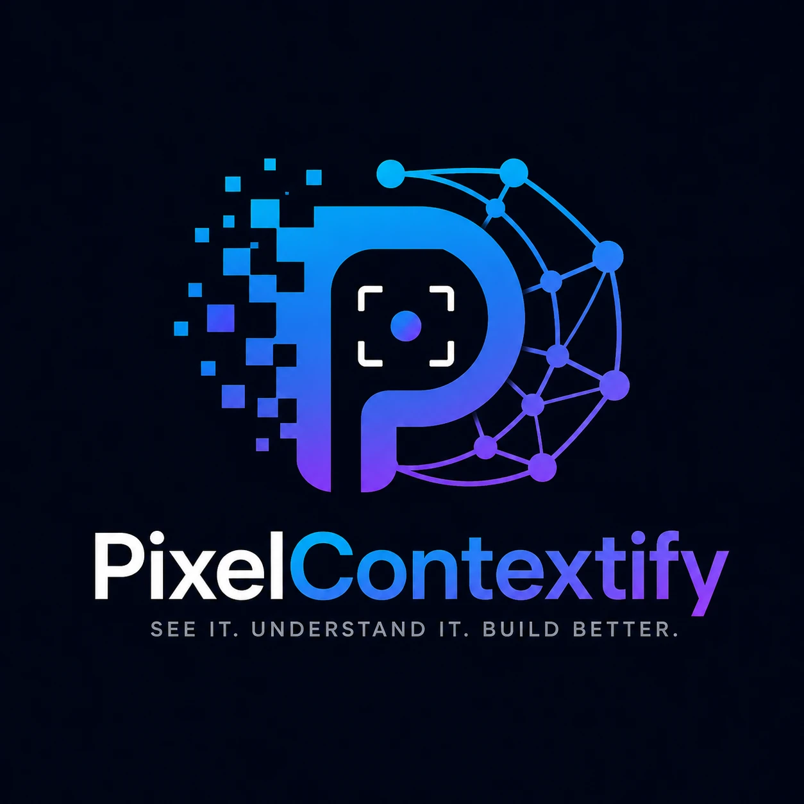

<div align="center">



# Contextify

### A persistent context engine for AI coding assistants

*Your AI re-discovers your project in every conversation. Contextify gives it a memory.*

[](https://github.com/Sam123336/PixelContextify)
[](LICENSE)
[](https://modelcontextprotocol.io)
[](#-tools)
[](#-tools)

**[Quick start](#-quick-start-60-seconds) · [Setup](#-setup) · [Your own API key](#-use-your-own-api-key-for-image-reading) · [Tools](#-tools) · [Self-hosting](#-self-hosting)**

</div>

---

## 🤔 What is Contextify?

Every AI assistant has the same problem: **it forgets your project between conversations.** Each time you ask a question, it searches dozens of files, re-reads the same code, re-analyzes the same screenshots, and guesses at dependencies. You pay in **time, tokens, and wrong answers**.

Contextify fixes this with two engines feeding one **Software Knowledge Graph**:

| | 📸 Screenshot Engine | 🕸️ Code Engine |
|---|---|---|
| **Input** | UI screenshots (PNG/JPEG/WebP) | Your React/Next.js or Flutter code |
| **Output** | Structured markdown — screen type, components, layout, design issues | A live graph — components, routes, state, API calls and how they connect |
| **Saves** | ~95% of vision tokens per screenshot | Tens of thousands of exploration tokens per question |
| **Runs** | Free hosted backend (or your own key/server) | **100% on your machine — code never leaves it** |

```
Without Contextify                      With Contextify

"How does checkout work?"               "How does checkout work?"
  → Claude searches 40+ files             → Claude asks the graph
  → reads 15–20 of them                   → gets the traced flow + file paths
  → guesses the rest                      → reads only 2–3 files for detail

~45 s · ~60,000 tokens · guesses        ~2 s · a few hundred tokens · verified
```

---

## ⚡ Quick start (60 seconds)

**1.** Install the plugin (no account, no API key needed):

```bash
claude plugin marketplace add Sam123336/PixelContextify
claude plugin install contextify@contextify
```

**2.** Open a new Claude Code session inside your project and ask:

> index this project with contextify

**3.** That's it. Now try:

> show me the project map
> what breaks if I change ProductCard?
> trace the flow from /cart to /orders
> analyze this screenshot with contextify: /path/to/screenshot.png

💡 Bonus: open `.pixelcontextify/graph.html` in any browser — an interactive map of your whole app.

---

## 📦 Setup

Pick the one that matches how you work:

<details>
<summary><b>🖥️ Claude Code (CLI or VS Code extension) — recommended</b></summary>

<br>

If you don't have Claude Code yet:

```bash
npm install -g @anthropic-ai/claude-code
```

Then install the plugin (from any terminal):

```bash
claude plugin marketplace add Sam123336/PixelContextify
claude plugin install contextify@contextify
```

Or from *inside* a Claude Code session:

```
/plugin marketplace add Sam123336/PixelContextify
/plugin install contextify@contextify
```

Start a **new** session and the 14 tools + 2 skills are available automatically. Updating later: `claude plugin update contextify`.

</details>

<details>
<summary><b>🖱️ Claude Desktop app</b></summary>

<br>

Claude Desktop uses an MCP config file instead of the plugin marketplace.

**1.** Clone this repo somewhere permanent:

```bash
git clone https://github.com/Sam123336/PixelContextify.git ~/contextify
```

**2.** Open your Claude Desktop config:

- **macOS:** `~/Library/Application Support/Claude/claude_desktop_config.json`
- **Windows:** `%APPDATA%\Claude\claude_desktop_config.json`

**3.** Add Contextify to `mcpServers` (use your real absolute path):

```json
{
  "mcpServers": {
    "contextify": {
      "command": "node",
      "args": ["/Users/you/contextify/packages/mcp-server/bundle/index.cjs"],
      "env": {
        "CONTEXTIFY_BACKEND_URL": "https://contextify-backend-mdrs.onrender.com"
      }
    }
  }
}
```

**4.** Restart Claude Desktop. Ask Claude to *"index the project at /path/to/my/app with contextify"* (Desktop needs absolute paths since it has no working directory).

</details>

<details>
<summary><b>🎯 Cursor / any other MCP client</b></summary>

<br>

Any MCP-capable client works the same way as Claude Desktop: run the server over stdio.

```json
{
  "mcpServers": {
    "contextify": {
      "command": "node",
      "args": ["/absolute/path/to/PixelContextify/packages/mcp-server/bundle/index.cjs"]
    }
  }
}
```

</details>

<details>
<summary><b>⌨️ CLI only (no AI at all — terminals, scripts, CI)</b></summary>

<br>

The same binary is a standalone CLI — with its own terminal branding (blue→purple gradient on real TTYs, plain when piped, respects `NO_COLOR`):

```
 ▄▄▄▄▄ ▄▄▄▄▄ ▄   ▄ ▄▄▄▄▄ ▄▄▄▄▄ ▄   ▄ ▄▄▄▄▄ ▄▄▄ ▄▄▄▄▄ ▄   ▄
 █     █   █ ██  █   █   █      ▀▄▀    █    █  █      ▀▄▀
 █     █   █ █ █ █   █   █▄▄▄  ▄▀ ▀▄   █    █  █▄▄▄    █
 █▄▄▄▄ █▄▄▄█ █  ██   █   █▄▄▄▄ █   █   █   ▄█▄ █       █
 see it · understand it · build better
```

```bash
node packages/mcp-server/bundle/index.cjs index .              # build graph + graph.html
node packages/mcp-server/bundle/index.cjs map .                # routes, components, nav flow
node packages/mcp-server/bundle/index.cjs analyze .            # architecture score
node packages/mcp-server/bundle/index.cjs impact . ProductCard # blast radius + risk
node packages/mcp-server/bundle/index.cjs feature . Checkout   # feature dossier
node packages/mcp-server/bundle/index.cjs diff .               # what changed
```

The graph itself is plain JSON at `.pixelcontextify/graph.json` — the format is documented in [docs/GRAPH-SPEC.md](docs/GRAPH-SPEC.md), so any tool can consume it.

</details>

---

## 🔑 Use your own API key for image reading

Screenshot analysis works **out of the box** with the free hosted backend — no key needed. But you can plug in your own LLM key for faster/better/private image reading. Your key is sent per request and **never stored server-side**.

Set these environment variables where Claude Code runs:

| Env var | What it does | Required? |
|---|---|---|
| `CONTEXTIFY_LLM_PROVIDER` | `gemini`, `openai`, `anthropic`, or `openai-compatible` | yes (to enable) |
| `CONTEXTIFY_LLM_API_KEY` | Your key for that provider | yes (to enable) |
| `CONTEXTIFY_LLM_MODEL` | Model id | only for `openai-compatible` |
| `CONTEXTIFY_LLM_BASE_URL` | Endpoint URL | only for `openai-compatible` |
| `CONTEXTIFY_BACKEND_URL` | Your own backend instead of the hosted one | no |

<details>
<summary><b>Example: Google Gemini</b></summary>

```bash
export CONTEXTIFY_LLM_PROVIDER=gemini
export CONTEXTIFY_LLM_API_KEY=AIza...
```
</details>

<details>
<summary><b>Example: OpenAI</b></summary>

```bash
export CONTEXTIFY_LLM_PROVIDER=openai
export CONTEXTIFY_LLM_API_KEY=sk-...
```
</details>

<details>
<summary><b>Example: Anthropic Claude</b></summary>

```bash
export CONTEXTIFY_LLM_PROVIDER=anthropic
export CONTEXTIFY_LLM_API_KEY=sk-ant-...
```
</details>

<details>
<summary><b>Example: Groq / OpenRouter / Ollama / any OpenAI-compatible endpoint</b></summary>

```bash
export CONTEXTIFY_LLM_PROVIDER=openai-compatible
export CONTEXTIFY_LLM_API_KEY=gsk_...
export CONTEXTIFY_LLM_MODEL=llama-3.2-90b-vision-preview
export CONTEXTIFY_LLM_BASE_URL=https://api.groq.com/openai/v1
```

Works with any endpoint that speaks the OpenAI Chat Completions API and has a vision-capable model — Groq, OpenRouter, Together, Fireworks, vLLM, Ollama…
</details>

| Provider | `provider` value | Default model |
|---|---|---|
| Google Gemini | `gemini` | `gemini-2.5-flash-lite` |
| OpenAI | `openai` | `gpt-4o` |
| Anthropic Claude | `anthropic` | `claude-3-5-sonnet-latest` |
| OpenAI-compatible | `openai-compatible` | *(you specify)* |

> 🗒️ **Note:** the key is only for the **screenshot** engine. The code graph never uses any LLM — it's a compiler-style parser that runs entirely on your machine.

---

## 🧰 Tools

14 MCP tools, available the moment the plugin is installed:

### 📸 Screenshots

| Tool | What it does |
|---|---|
| `analyze_screenshot` | Screenshot → structured developer markdown (~95% fewer vision tokens), with token-savings stats |
| `get_screenshot` | Fetch a previous analysis by id |

### 🕸️ Software Knowledge Graph

| Tool | What it does |
|---|---|
| `index_project` | Build/refresh the graph (100% local, incremental — milliseconds after first run). Also writes the interactive `graph.html` visualization |
| `get_project_map` | Every route with its component tree + API calls, plus a Mermaid navigation diagram |
| `trace_flow` | 🔥 User journeys as styled flow diagrams: cart → screens → API calls → order tracking, with numbered steps and file paths. A whole checkout flow ≈ 200–500 tokens instead of reading dozens of files |
| `get_impact` | "What breaks if I change X?" — affected components/routes/contexts, APIs in the blast radius, Low/Med/High regression risk. Also answers reverse queries: "where does GET /products appear visually?" |
| `what_if` | 🔥 Digital twin: simulate `remove` / `split` / `lazy_load` **before** touching code — what breaks, what stays safe, whether it's worth it |
| `explain_visually` | Multi-diagram Mermaid dossier for any node: how users reach it, what it's made of, where its data flows, and a state-placement decision tree with *your project's* branch highlighted (speaks React *and* Flutter) |
| `analyze_project` | Architecture score 0–100: circular imports, dead code, unused API routes, oversized components, usage heatmap, state fan-out |
| `get_feature` | Think in features, not files: "explain Authentication" → its routes, components, state, APIs, and entry points |
| `match_screenshot` | "Orange Checkout Button" → the component that implements it + the screens it appears on |
| `search_graph` | Find any component/route/API by name with its full relationship neighborhood |
| `graph_diff` | What changed architecturally between two snapshots |
| `graph_timeline` | The whole architecture's evolution, dated and git-commit-tagged |

### 🤖 Bundled skills (zero setup)

- **codegraph-copilot** — "explain this project", "find the payment flow", "estimate this feature", "break it into tickets", root-cause analysis via graph + git history
- **codegraph-refactor** — prioritized refactoring plans where every suggestion is impact-checked first

---

## ✨ Why it's different

- 🧠 **Compiler, not chatbot** — the graph is built by real parsers (TypeScript compiler for React/Next.js, structural scanner for Flutter). The AI only *queries*; it never guesses structure.
- ⚡ **Live context** — every answer hash-checks your files first and auto-refreshes if code changed. No manual re-indexing, ever.
- 🚀 **Incremental indexing** — only changed files (plus their importers) are re-parsed. No-op re-index: **~17ms**, verified byte-identical to a full rebuild.
- 🗺️ **Interactive visualization** — `.pixelcontextify/graph.html`: force-directed map, color-coded types, search, filters, click any node for its relationships. Works offline, zero dependencies.
- 🕰️ **Temporal graph** — snapshots on every change, tagged with git commits. Ask "what changed this month?"
- 🔓 **Open format** — the graph is documented JSON ([spec](docs/GRAPH-SPEC.md)); any MCP client or plain script can use it.
- 🔒 **Private by design** — source code never leaves your machine. Only screenshots touch a server (and you can self-host that too).

---

## 🌐 HTTP API (screenshot backend)

Use the backend without any plugin:

| Method | Path | Description |
|---|---|---|
| POST | `/screenshots` | Multipart upload (`file`); enqueues analysis |
| GET | `/screenshots/:id` | Status + markdown + token savings |
| GET | `/health` | Liveness check |

Per-request key override headers (key lives only on the in-flight job):

```bash
curl -X POST https://<backend-url>/screenshots \
  -H "x-llm-provider: openai" \
  -H "x-llm-api-key: sk-..." \
  -F "file=@./screenshot.png"
```

Headers: `x-llm-provider`, `x-llm-api-key`, `x-llm-model` (optional), `x-llm-base-url` (openai-compatible only).

---

## 🏠 Self-hosting

<details>
<summary><b>Run locally</b></summary>

<br>

Prerequisites: Node.js 20+, pnpm 9+, Docker.

```bash
pnpm install
docker compose up -d postgres redis
cp .env.example packages/backend/.env   # set LLM_API_KEY
pnpm dev                                # API on http://localhost:3000
```

Point the plugin at it with `CONTEXTIFY_BACKEND_URL=http://localhost:3000`.

Server-default LLM config (`packages/backend/.env`):

```bash
LLM_PROVIDER=gemini   # gemini | openai | anthropic | openai-compatible
LLM_API_KEY=          # key for the chosen provider
LLM_MODEL=            # blank → provider default; required for openai-compatible
LLM_BASE_URL=         # only for openai-compatible
```
</details>

<details>
<summary><b>Deploy on Render (free tier)</b></summary>

<br>

[`render.yaml`](render.yaml) is a ready-made blueprint. Create a free Postgres database ([Neon](https://neon.tech)) and Redis ([Upstash](https://upstash.com)), then on [Render](https://render.com): **New → Blueprint** → pick your fork → fill in `DATABASE_URL`, `REDIS_URL`, and `LLM_API_KEY`. Free-plan note: the service sleeps after ~15 idle minutes and takes ~30–60s to wake.
</details>

<details>
<summary><b>Deploy on Azure</b></summary>

<br>

[`deploy/azure.sh`](deploy/azure.sh) provisions Container Apps + managed Postgres + Redis and prints the public URL:

```bash
az login
PG_PASSWORD='<strong-pw>' LLM_API_KEY='<your-key>' ./deploy/azure.sh
```

Redeploys are a button press via the [manual GitHub Actions workflow](.github/workflows/deploy-azure.yml) once the repo secrets/variables documented in that file are set.

Notes for any host: schema is created automatically on boot (Sequelize `synchronize`); single replica by default — uploads are written to local disk and read by the in-process worker. To scale out, mount shared storage at `UPLOAD_DIR`.
</details>

---

## 🗂️ Repository layout

<details>
<summary>pnpm workspace monorepo</summary>

<br>

| Package | Purpose |
|---|---|
| `packages/backend` | NestJS API + BullMQ worker + multi-provider LLM pipeline |
| `packages/mcp-server` | MCP server + CLI + graph engine (the plugin) |
| `packages/shared` | Shared TypeScript types |
| `packages/vscode-extension` | VS Code clipboard / drag-drop integration |

Rebuild the plugin bundle after changing `packages/mcp-server`:

```bash
pnpm --filter @contextify/mcp-server run bundle:plugin   # → bundle/index.cjs
```

**VS Code extension:** drop or paste a screenshot into any editor, or run **"Contextify: Analyze Image File…"** from the Command Palette; markdown is inserted at the cursor. Configure via `contextify.*` settings. Package with `cd packages/vscode-extension && pnpm run package`.
</details>

---

## ❓ FAQ

<details>
<summary><b>Does my code get uploaded anywhere?</b></summary>
<br>
No. The code graph is built entirely on your machine by a local parser and stored in your project folder (auto-gitignored). Only <em>screenshots</em> are sent to the analysis backend — and you can self-host that or bring your own key.
</details>

<details>
<summary><b>Which frameworks are supported?</b></summary>
<br>
React and Next.js (app router + pages router) with full TypeScript-compiler fidelity. Flutter/Dart in beta: widgets, GoRouter + named routes, http/dio, Riverpod/Provider/Bloc. Mixed monorepos merge into one graph. React Router / React Navigation / Expo Router route detection is on the roadmap.
</details>

<details>
<summary><b>Do I need to re-index after every change?</b></summary>
<br>
No. Every graph tool checks file hashes before answering and auto-refreshes if anything changed. Re-indexing is incremental — milliseconds, not seconds.
</details>

<details>
<summary><b>The first screenshot call is slow — why?</b></summary>
<br>
The free-tier backend sleeps when idle and takes ~30–60s to wake. Subsequent calls are fast. Self-host or bring your own key to avoid it.
</details>

---

<div align="center">

**MIT License** · Built by [PixelContextify](https://github.com/Sam123336/PixelContextify) · Issues and PRs welcome 🙌

</div>
